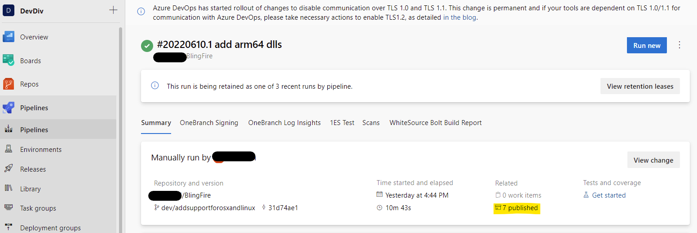
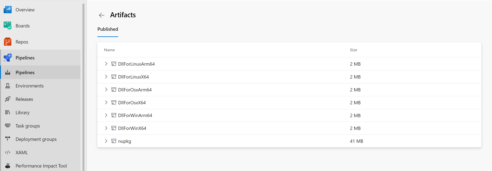
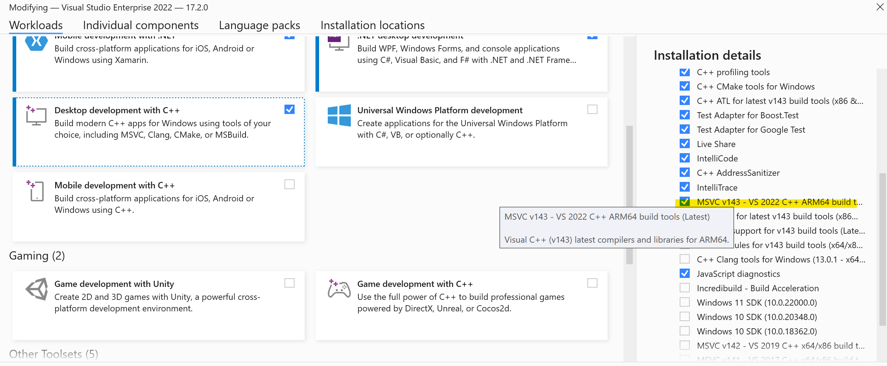

# Bling Fire Nuget package for C#

This folder contains nuget package sources for the Bling Fire Tokenizer wrapper code. It also includes native DLLs and binary files.

To provide better experience on the target platform, we include wrapper code as a source rather than as a compiled assembly. When wrapper code is compiled on Linux and runs on Linux the DllImport directive knows to search for lib...so rathen then for a dll. The wrapper code is very small and hardly there is any advantage in having a separate assembly for it.

To test C# code use the following commands:

0. one time install dotnet framework, see this link for Linux: https://docs.microsoft.com/en-us/dotnet/core/install/linux-ubuntu
1. cd BlingFire/nuget/test
2. dotnet run -- BlingUtilsTest


This will compile and run the small [test program](https://github.com/microsoft/BlingFire/blob/master/nuget/test/Program.cs), you should see something like this in the output:
```
Start C# test...
Bling Fire version: 7000
BlingFireUtils.TextToSentences: 'Autophobia, also called monophobia, isolophobia, or eremophobia, is the specific phobia of isolation.
I saw a girl with a telescope.
Я увидел девушку с телескопом.'
BlingFireUtils.GetWords: 'Autophobia, also called monophobia, isolophobia, or eremophobia, is the specific phobia of isolation.
I saw a girl with a telescope.
Я увидел девушку с телескопом.'
BlingFireUtils.TextToWords: 'Autophobia , also called monophobia , isolophobia , or eremophobia , is the specific phobia of isolation . I saw a girl with a telescope . Я увидел девушку с телескопом .'
BlingFireUtils.GetWords: 'Autophobia , also called monophobia , isolophobia , or eremophobia , is the specific phobia of isolation . I saw a girl with a telescope . Я увидел девушку с телескопом .'
BlingFireUtils.NormalizeSpaces: 'Autophobia,▁also▁called▁monophobia,▁isolophobia,▁or▁eremophobia,▁is▁the▁specific▁phobia▁of▁isolation.▁I▁saw▁a▁girl▁with▁a▁telescope.▁Я▁увидел▁девушку▁с▁телескопом.'
Model handle: 94403232303952
Model handle: 94403233096000
Model handle: 94403234053488
Model: bert_base_tok
return length: 62
return array: [8285, 24920, 1010, 2036, 2170, 18847, 24920, 1010, 11163, 4135, 24920, 1010, 2030, 9413, 6633, 7361, 6806, 11607, 1010, 2003, 1996, 3563, 6887, 16429, 2401, 1997, 12477, 1012, 1045, 2387, 1037, 2611, 2007, 1037, 12772, 1012, 1210, 1198, 25529, 10325, 29742, 15290, 29436, 1184, 15290, 25529, 29748, 29753, 23925, 29748, 1196, 1197, 15290, 29436, 15290, 29747, 23925, 14150, 29746, 14150, 29745, 1012]
IdsToText: autophobia , also called monophobia , isolophobia , or eremophobia , is the specific phobia of isolation . i saw a girl with a telescope . я увидел девушку с телескопом .
Model: xlnet
return length: 61
return array: [5445, 23174, 19, 77, 271, 7412, 23174, 19, 27, 8292, 23174, 19, 49, 17, 118, 16465, 23174, 19, 27, 18, 1240, 17, 23174, 20, 11491, 9, 35, 685, 24, 1615, 33, 24, 16163, 9, 17, 0, 17, 0, 25711, 15893, 0, 19957, 0, 17, 0, 19957, 25711, 0, 17, 0, 17, 0, 19957, 0, 19957, 0, 17329, 0, 17329, 0, 9]
IdsToText: Autophobia, also called monophobia, isolophobia, or eremophobia, is the specific phobia of isolation. I saw a girl with a telescope.  вие ев  ееоо.
Model: xlm_roberta_base
return length: 49
return array: [4396, 22014, 9166, 4, 2843, 35839, 22460, 22014, 9166, 4, 83, 7537, 22014, 9166, 4, 707, 6, 102835, 22014, 9166, 4, 83, 70, 29458, 53073, 9166, 111, 6, 219488, 5, 87, 24124, 10, 23040, 678, 10, 5501, 70820, 5, 1509, 79132, 29513, 105, 46009, 135, 18293, 41333, 419, 5]
IdsToText: Autophobia, also called monophobia, isolophobia, or eremophobia, is the specific phobia of isolation. I saw a girl with a telescope. Я увидел девушку с телескопом.
return length: 62
tokens from offsets: ['Auto'/8285 'phobia'/24920 ','/1010 'also'/2036 'called'/2170 'mono'/18847 'phobia'/24920 ','/1010 'iso'/11163 'lo'/4135 'phobia'/24920 ','/1010 'or'/2030 'er'/9413 'em'/6633 'op'/7361 'ho'/6806 'bia'/11607 ','/1010 'is'/2003 'the'/1996 'specific'/3563 'ph'/6887 'ob'/16429 'ia'/2401 'of'/1997 'isolation'/12477 '.'/1012 'I'/1045 'saw'/2387 'a'/1037 'girl'/2611 'with'/2007 'a'/1037 'telescope'/12772 '.'/1012 'Я'/1210 'у'/1198 'в'/25529 'и'/10325 'д'/29742 'е'/15290 'л'/29436 'д'/1184 'е'/15290 'в'/25529 'у'/29748 'ш'/29753 'к'/23925 'у'/29748 'с'/1196 'т'/1197 'е'/15290 'л'/29436 'е'/15290 'с'/29747 'к'/23925 'о'/14150 'п'/29746 'о'/14150 'м'/29745 '.'/1012 ]
return length: 61
tokens from offsets: ['Auto'/5445 'phobia'/23174 ','/19 ' also'/77 ' called'/271 ' mono'/7412 'phobia'/23174 ','/19 ' is'/27 'olo'/8292 'phobia'/23174 ','/19 ' or'/49 ' '/17 'er'/118 'emo'/16465 'phobia'/23174 ','/19 ' is'/27 ' the'/18 ' specific'/1240 ' '/17 'phobia'/23174 ' of'/20 ' isolation'/11491 '.'/9 ' I'/35 ' saw'/685 ' a'/24 ' girl'/1615 ' with'/33 ' a'/24 ' telescope'/16163 '.'/9 ' '/17 'Я'/0 ' '/17 'у'/0 'в'/25711 'и'/15893 'д'/0 'е'/19957 'л'/0 ' '/17 'д'/0 'е'/19957 'в'/25711 'ушку'/0 ' '/17 'с'/0 ' '/17 'т'/0 'е'/19957 'л'/0 'е'/19957 'ск'/0 'о'/17329 'п'/0 'о'/17329 'м'/0 '.'/9 ]
return length: 49
tokens from offsets: ['Auto'/4396 'pho'/22014 'bia'/9166 ','/4 ' also'/2843 ' called'/35839 ' mono'/22460 'pho'/22014 'bia'/9166 ','/4 ' is'/83 'olo'/7537 'pho'/22014 'bia'/9166 ','/4 ' or'/707 ' '/6 'eremo'/102835 'pho'/22014 'bia'/9166 ','/4 ' is'/83 ' the'/70 ' specific'/29458 ' pho'/53073 'bia'/9166 ' of'/111 ' '/6 'isolation'/219488 '.'/5 ' I'/87 ' saw'/24124 ' a'/10 ' girl'/23040 ' with'/678 ' a'/10 ' tele'/5501 'scope'/70820 '.'/5 ' Я'/1509 ' увидел'/79132 ' дев'/29513 'у'/105 'шку'/46009 ' с'/135 ' теле'/18293 'скоп'/41333 'ом'/419 '.'/5 ]
Model handle: 94403233096000
'Au-topho-bia' ',' 'al-so' 'called' 'mono-pho-bia' ',' 'iso-lopho-bia' ',' 'or' 'e-re-mopho-bia' ',' 'is' 'the' 'spe-ci-fic' 'pho-bia' 'of' 'iso-la-tion' '.' 'I' 'saw' 'a' 'girl' 'with' 'a' 'te-le-s-cope' '.' 'Я' 'уви-дел' 'де-ву-шку' 'с' 'те-лес-ко-пом' '. ' 
Test Complete
```
Note: In Windows console default encoding is set to something old so only ascii symbols will be printed, but this is a display issue. You can manually set it to use UTF-8 if you want proper output.

After changes were made to the nuget package, to create a new NuGet package run from the lib folder (here use Release configuration since we are going to publish it):
```
dotnet pack --configuration Release
```


Test it first by publishing into a local repo (you need to install nuget.exe on linux and on Windows, see https://www.nuget.org/downloads):
```
# on Linux
nuget.exe add lib/bin/Release/BlingFireNuget.0.1.5.nupkg -Source /home/sergei/BlingFire2/tmplocalnugetrepo/packages/

# on Windows
C:\src\BlingFire\nuget\lib>c:\Users\sergeio\Downloads\nuget.exe add bin\Release\BlingFireNuget.0.1.7.nupkg -Source C:/Users/sergeio/mytestnugets

```

Make sure your local NuGet.config contains this directory as a feed:
```
<?xml version="1.0" encoding="utf-8"?>
<configuration>
  <packageSources>
    <add key="nuget.org" value="https://api.nuget.org/v3/index.json" protocolVersion="3" />
    <add key="Test Source" value="/home/sergei/BlingFire2/tmplocalnugetrepo/packages" />
  </packageSources>
</configuration>
```

Now update the test project to consume a new version and run it (note here use Debug configuration, because paths to the model files are hardcode the configuration type):
```
mcedit BlingUtilsTest.csproj
dotnet run --configuration Debug BlingUtilsTest.csproj
```


After verifying the package works correctly localy, upload the nupkg to nuget.org.

To publish to GitHub (optional) use the following command, it requires having API token, which can be regenerated via Account / Settings / DeveloperSettings / ... :
```
dotnet nuget push "bin/Release/BlingFire.x.y.z.nupkg" --source "github" --api-key a123687fef23b8bfake0234820394802ffebc233
```


When you publish to GitHub the lib directory should contain nuget.config file with the valid token for package writing:
```
<?xml version="1.0" encoding="utf-8"?>
<configuration>
    <packageSources>
        <clear />
        <add key="github" value="https://nuget.pkg.github.com/microsoft/index.json" />
    </packageSources>
    <packageSourceCredentials>
        <github>
            <add key="Username" value="xyz" />
            <add key="ClearTextPassword" value="0123456789" />
        </github>
    </packageSourceCredentials>
</configuration>
```

# Build Bling Fire dlls/NuGet package with Azure DevOps build pipeline

Now we can use Azure DevOps to build BlingFire dlls and NuGet package.

Pipeline file [azure-pipelines.yml](../azure-pipelines.yml) is now updated to be able to build BlingFire dlls for windows-x64, windows-arm64, osx-x64, osx-arm-64, linux-x64, linux-arm64.

Here are some good documentations about how to create Azure DevOps pipelines:

1. [Create your first pipeline.](https://docs.microsoft.com/en-us/azure/devops/pipelines/create-first-pipeline?view=azure-devops&tabs=java%2Ctfs-2018-2%2Cbrowser)
2. [Build GitHub repositories.](https://docs.microsoft.com/en-us/azure/devops/pipelines/repos/github?view=azure-devops&tabs=yaml)

A good thing about using Azure DevOps is: it provides [list of Microsoft-hosted agents](https://docs.microsoft.com/en-us/azure/devops/pipelines/agents/hosted?view=azure-devops&tabs=yaml), which include Windows, Linux and Osx, with all the popular tools pre-installed.

However, there are no ARM64 microsoft-hosted agents yet, so currently in [azure-pipelines.yml](../azure-pipelines.yml) all the ARM64 dlls are built with cmake cross-compiling from X64 agents.
<br/><br/>

## Build pipeline for Github BlingFire repo 
A [build pipeline](https://devdiv.visualstudio.com/DevDiv/_build?definitionId=16503&_a=summary) for [Github BlingFire repo](https://github.com/microsoft/BlingFire) is created (only accessble by Microsoft interal users). It will be triggered whenerver thare's new commeits to master branch.
<br/><br/>

## Get dlls and NuGet from Azure DevOps Build pipeline
When the one instance of the build pipeline completed sucessfuly, 7 artifacts will be avaible to download from Azure DevOps.

We can find the artifacts by clicking the highlighted <mark>"7 published"</mark> as shows in the following image.


Then we can find the artifacts:


The first 6 are native dlls for each platform, the last one is the Nuget package of Bling Fire with all the latest dlls. To download, simply click on them.
<br/><br/>


# Build Bling Fire Dlls/Nuget package locally
We can follow steps in [azure-pipelines.yml](../azure-pipelines.yml) to build dlls locally.

## windows-x64
Build platform is windows-x64.
Please make sure visual studio 'Desktop development with C++' is installed. 
steps:
```
1. cd BlingFire
2. mkdir Release
3. cd Release
4. cmake ..
5. MSBuild.exe /property:Configuration=Release .\BLING_FIRE.sln
```

## windows-arm64
Build platform is windows-x64.
Please make sure visual studio 'Desktop development with C++' is installed.
Please Install 'c++ arm64 build tools' through visual studio:

steps:
```
1. cd BlingFire
2. mkdir Release
3. cd Release
4. cmake -A ARM64 ..
5. MSBuild.exe /property:Configuration=Release .\BLING_FIRE.sln
```

## osx-x64
Build platform osx-x64.
please make sure 'make' and 'cmake' is installed.(xcode should have all the necessary tools)
```
1. cd BlingFire
2. mkdir Release
3. cd Release
4. cmake ..
5. make
```
## osx-arm64 (cross-compiling from osx-x64)
Build platform is osx-64.
Installing xcode should provide all the necessary tools for cross-compiling.
```
1. cd BlingFire
2. mkdir Release
3. cd Release
4. cmake -DCMAKE_OSX_ARCHITECTURES=arm64 -DCMAKE_BUILD_TYPE=Release ..
5. make
```

## linux-x64
Build platform is linux-x64.
Please make sure 'make' and 'cmake' is installed.
```
1. cd BlingFire
2. mkdir Release
3. cd Release
4. cmake ..
5. make
```

## linux-arm64
Build platform is linux-x64.
Please make sure 'make' and 'cmake' is installed. 
Please run the following steps to install the aarch64 supported tools:
```
1. sudo apt-get update
2. sudo apt-get install -y gcc-aarch64-linux-gnu
3. sudo apt-get install -y g++-aarch64-linux-gnu
```

Also, [cmake toolchain file](../buildTools/linux-arm64-cross.cmake) is used for cross-compiling.

```
2. cd BlingFire
3. mkdir Release
4. cd Release
5. cmake -DCMAKE_TOOLCHAIN_FILE=../buildTools/linux-arm64-cross.cmake -DCMAKE_BUILD_TYPE=Release ..
6. make
```

